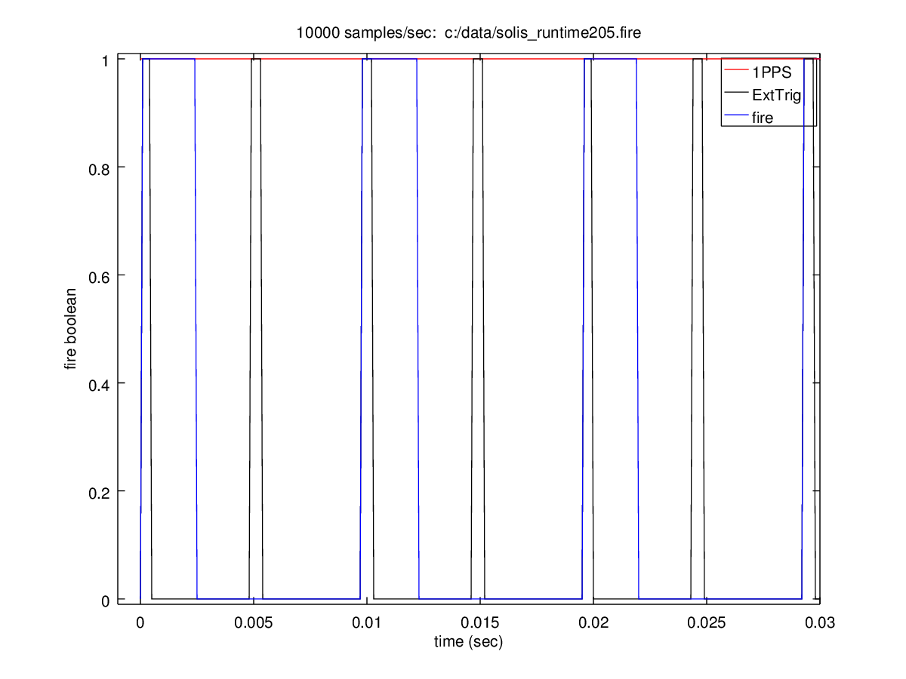

===============
led-timemeasure
===============

We use known LED sequences to test camera timing. The user will have two or more
cameras they wish to test the time synchronization of the exposures via an LED
flashing sequence.

Camera requirements
--------------------
Each camera should have a hardware external trigger input that is driven by a
stable (long-term and short-term) clock source controlling an ASIC or FPGA outputting
a pulse train with period matching the desired frame rate.

Additionally, the cameras should have a "fire" output which is a hardware output
telling the instant when the exposure started. In our system we pack this into a byte
and record this as a ``.fire`` file

Software requirements
---------------------
Octave 4.0+ with the `fits package <https://scivision.co/using-fitsio-in-octave-under-cygwin/>`_
or Matlab

Testing Programs
-----------------
============== =============
program        description
============== =============
RunLEDplot      click on LED coordinates, which are saved to _Coord.h5 files. Plots made to verify clicks (should see square waves with distinct frequencies matching LEDs
RunledMatcher   given video input, makes plot of simulated LEDs against 1-D pixel vs time brightness. Sim should match video! does NOT use .fire measurements
============== =============

Utilities
---------
============== =============
program        description
============== =============
Runsimleds     test run of LED simulated square wave (that are used in RunledMatcher)
RunFireReader  read and plot .fire file recorded from real camera **outputs time of exposures corrected for dropped frames**
============== =============

Examples
--------
Read and plot a .fire file for manual examination of missed frames, and estimate of absolute UTC time, where your system sent ``pps`` pulses per second to the camera::

    RunFireReader('c:/data/mytest.fire',pps)

In this example, the camera could not keep up with the requested frame rate as we do not see a 1:1 correspondence between
``Ext Trig`` and ``Fire``.  The width of the pulses don't matter here, it's the fact that some ``Ext Trig`` pulses do not have
corresponding ``Fire`` pulses, meaning the camera didn't take a picture without a ``Fire`` pulse.
    

TODO
----

======================= =================
task                    description
======================= =================
update RunledMatcher      to use the computed time from RunFireRader functions automatically implements correction from RunFireReader
======================= =================
